# 🛠️ Power BI PBIP Skills

Automation skills for Power BI projects in **PBIP format**. Streamline your workflow with batch operations, SVG manipulation, semantic documentation, and more.

[](https://opensource.org/licenses/MIT)
[](https://powerbi.microsoft.com/)
[](https://docs.microsoft.com/en-us/powershell/)

## 🎯 What is PBIP?

PBIP (Power BI Project) is an **open format** that stores Power BI reports and semantic models as **plain text files**. This enables:

- ✅ Version control with Git
- ✅ Collaboration via pull requests
- ✅ Offline metadata editing
- ✅ Automated batch operations

## 📦 Available Skills

### 🎨 skill-svg-recolor-powerbi

Automatically change the color of **all SVG icons** in your Power BI PBIP project.

**Use Case:** You have a report with 142 icons in blue, and you want to change them all to red **in 2 seconds** without opening Power BI Desktop.

**Clone only this skill:**
```bash
git clone --filter=blob:none --sparse https://github.com/CSalcedoDataBI/powerbi-pbip-tools.git
cd powerbi-pbip-tools
git sparse-checkout set skills/skill-svg-recolor-powerbi
```

#### Workflow



```mermaid
flowchart LR
    A["📂 PBIP Project"] --> B["🔍 detect-colors.ps1"]
    B --> C["📊 Color Report"]
    C --> D["🎨 recolor.ps1"]
    D --> E["✅ SVGs Updated"]
    E --> F["📊 Open in Power BI"]
```

**[📖 Read the full documentation →](skills/skill-svg-recolor-powerbi/README.md)**

**Quick Start:**
```powershell
# Detect all colors in your project
.\skills\skill-svg-recolor-powerbi\scripts\detect-colors.ps1 -PbipDir "C:\MyProject"

# Change all blue icons to red
.\skills\skill-svg-recolor-powerbi\scripts\recolor.ps1 -PbipDir "C:\MyProject" -From "#0078D4" -To "#DC143C"
```

---

### 🧠 skill-semantic-architect-powerbi

Transform technical Power BI data models into **fully documented semantic models** — auto-generates descriptions, KPIs, and a complete Context Store using **MCP** (Model Context Protocol) as a bidirectional bridge.

**Use Case:** You have a model with 12 tables and 87 undocumented columns. The skill scans the model, researches industry KPIs, generates business descriptions for every object, and writes them back — turning you from a manual builder into an **Intelligence Auditor**.

**Clone only this skill:**
```bash
git clone --filter=blob:none --sparse https://github.com/CSalcedoDataBI/powerbi-pbip-tools.git
cd powerbi-pbip-tools
git sparse-checkout set skills/skill-semantic-architect-powerbi
```

#### Workflow



```mermaid
flowchart LR
    A["🤖 Phase 1\nModel DNA Scan"] --> B["🔬 Phase 2\nDeep Research"]
    B --> C["📋 Phase 3\nContext Store"]
    C --> D["👤 Phase 4\nExpert Audit"]
```

| Phase | Action | Mode |
|-------|--------|------|
| 1. Scan | Extract tables, columns, relationships via MCP. Classify industry & architecture | 🤖 Auto |
| 2. Research | Web search for industry KPIs, business questions, DAX patterns | 🤖 Auto |
| 3. Context Store | Generate semantic map with descriptions, visibility rules & KPI catalog | 🤖 Auto |
| 4. Audit | Expert reviews & approves → AI writes to the model via MCP | 👤 + 🤖 |

**[📖 Documentación en Español →](skills/skill-semantic-architect-powerbi/SKILL.md)** · **[📖 English Documentation →](skills/skill-semantic-architect-powerbi/SKILL.en.md)**

**Includes:**
- 📄 Context Store template with 4 structured sections
- 🔍 Industry research prompts for 7+ industries
- 📏 Naming conventions for DAX measures, descriptions & technical column detection
- 📊 Complete Retail example (Contoso model)
- 🌐 All documentation available in **Spanish** and **English** (`.en.md`)

---

## 🚀 Getting Started

### Prerequisites

- **Power BI Desktop** (with PBIP format support)
- **PowerShell 5.1+** (included in Windows)
- **Git** (optional, for version control)
- **MCP Server** (required for skill-semantic-architect-powerbi)

### Installation

1. **Clone this repository:**
   ```powershell
   git clone https://github.com/CSalcedoDataBI/powerbi-pbip-tools.git
   cd powerbi-pbip-tools
   ```

2. **Or clone only the skill you need:**
   ```bash
   git clone --filter=blob:none --sparse https://github.com/CSalcedoDataBI/powerbi-pbip-tools.git
   cd powerbi-pbip-tools
   git sparse-checkout set skills/skill-svg-recolor-powerbi
   ```

3. **Try the Demo project:**
   ```powershell
   start examples/Demo/Demo.pbip
   .\skills\skill-svg-recolor-powerbi\scripts\detect-colors.ps1 -PbipDir ".\examples\Demo"
   .\skills\skill-svg-recolor-powerbi\scripts\recolor.ps1 -PbipDir ".\examples\Demo" -From "#0078D4" -To "#DC143C"
   ```

---

## 📚 Documentation

- **[SVG Recolor Guide](docs/skill-svg-recolor-powerbi-guide.md)** - Complete tutorial with examples
- **[SVG Recolor README](skills/skill-svg-recolor-powerbi/README.md)** - Skill-specific documentation
- **[Semantic Architect ES](skills/skill-semantic-architect-powerbi/SKILL.md)** - Documentación en español
- **[Semantic Architect EN](skills/skill-semantic-architect-powerbi/SKILL.en.md)** - Full English specification

---

## 🤝 Contributing

This repository is designed to be **extensible**. If you create a new skill for Power BI PBIP automation, feel free to contribute!

**Naming convention:** `skill-{name}-powerbi`

**Structure for new skills:**
```text
powerbi-pbip-tools/
├── skills/
│   ├── skill-svg-recolor-powerbi/           # SVG batch recoloring
│   ├── skill-semantic-architect-powerbi/    # Semantic model documentation
│   └── skill-your-name-powerbi/             # Your new skill
│       ├── README.md
│       ├── SKILL.md                         # Standard skill format (ES)
│       ├── SKILL.en.md                      # English version
│       └── scripts/
│           └── your-script.ps1
├── docs/
│   └── skill-your-name-powerbi-guide.md
└── examples/
    └── YourExample/
```

---

## 📄 License

MIT License - see [LICENSE](LICENSE) for details.

---

## 🔗 Links

- **Author:** [Cristobal Salcedo](https://csalcedodatabi.com)
- **Repository:** [github.com/CSalcedoDataBI/powerbi-pbip-tools](https://github.com/CSalcedoDataBI/powerbi-pbip-tools)
- **Issues:** [Report a bug or request a feature](https://github.com/CSalcedoDataBI/powerbi-pbip-tools/issues)

---

## 🌟 More Skills Coming Soon

This repository will grow with more automation skills for Power BI PBIP projects. Stay tuned!
